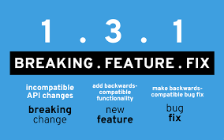

# Team

## Branching Flows

### Git Flow
- https://nvie.com/posts/a-successful-git-branching-model/

### Github Flow
- https://www.w3schools.com/git/git_github_flow.asp?remote=github
- https://habr.com/ru/post/346066/

### Gitlab Flow
- https://habr.com/ru/company/softmart/blog/316686

### Trunk Based Development
- https://habr.com/ru/post/519314/
- https://trunkbaseddevelopment.com/

### Release Flow

## Semver
- https://semver.org/lang/ru/

## Changelog

[Changelog](changelog.MD)

## CodeReview

[CodeReview](codereview.MD)

### Conventional Comments
- https://conventionalcomments.org/

## Team Wiki
- https://docusaurus.io/
- Confluence
- Vuepress
- Sphinx

## Styleguides
- https://github.com/best-doctor/guides/blob/master/guides/python_styleguide.md
- https://github.com/best-doctor/guides/blob/master/guides/api_guide.md

## Onboarding

- устно
- презентация
- видео
- веб-портал

## Team Routines

### Sync 🔁

### One2one 🔃

### StandUp ⬆️

### Performance Review 🆙

### Meetups ↗️

