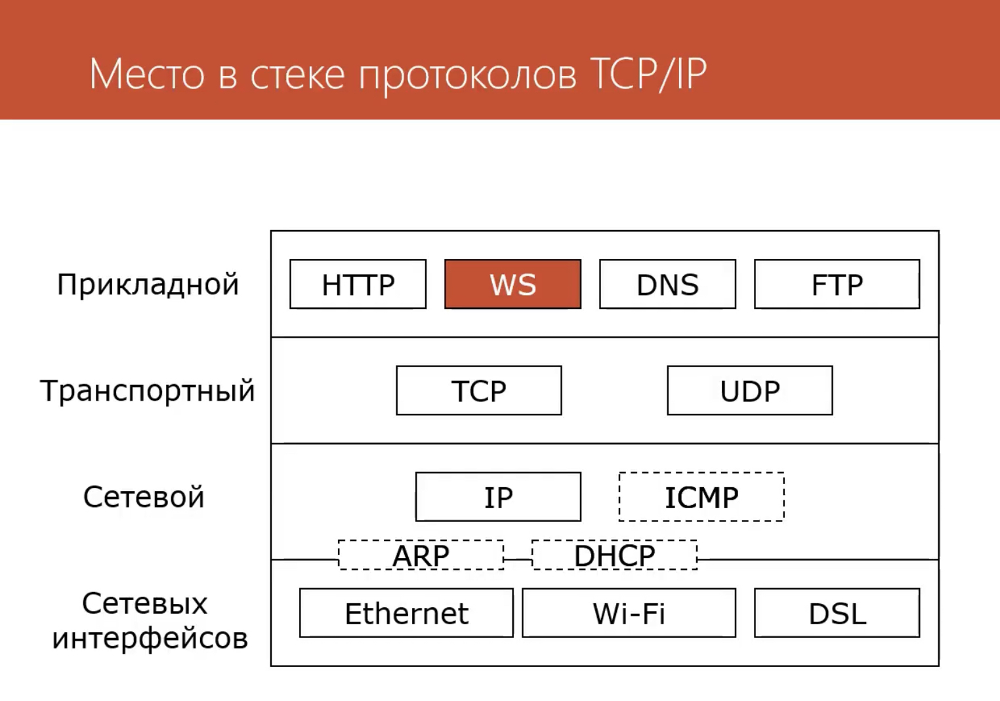

# Websocket

WebSocket — протокол связи поверх TCP-соединения, предназначенный для обмена сообщениями между браузером и веб-сервером в режиме реального времени.

В настоящее время в W3C осуществляется стандартизация API Web Sockets. Черновой вариант стандарта этого протокола утверждён IETF.

WebSocket разработан для воплощения в веб-браузерах и веб-серверах, но он может быть использован для любого клиентского или серверного приложения. Протокол WebSocket — это независимый протокол, основанный на протоколе TCP. Он делает возможным более тесное взаимодействие между браузером и веб-сайтом, способствуя распространению интерактивного содержимого и созданию приложений реального времени.



## Открытие канала WebSocket (протокол 07)


### Request
```HTTP
GET /chat HTTP/1.1
Host: server.example.com
Upgrade: websocket
Connection: Upgrade
Sec-WebSocket-Key: dGhlIHNhbXBsZSBub25jZQ==
Sec-WebSocket-Origin: http://example.com
Sec-WebSocket-Protocol: chat, superchat
Sec-WebSocket-Version: 7
```

### Response
```HTTP
HTTP/1.1 101 Switching Protocols
Upgrade: websocket
Connection: Upgrade
Sec-WebSocket-Accept: s3pPLMBiTxaQ9kYGzzhZRbK+xOo=
Sec-WebSocket-Protocol: chat
```


## Ping Pong


## Поддержка в браузерах

https://caniuse.com/websockets


## Шифрованное соединение wss

## Способы авторизации для websocket
Протокол WebSocket не обрабатывает авторизацию или аутентификацию. На практике это означает, что WebSocket, открытый со страницы за авторизацией, не получает «автоматически» какую-либо аутентификацию; вам необходимо предпринять шаги, чтобы также защитить соединение WebSocket.

Это можно сделать различными способами, поскольку WebSockets будут проходить через стандартные заголовки HTTP, обычно используемые для аутентификации. Это означает, что вы можете использовать тот же механизм аутентификации, который вы используете для своих веб-представлений в соединениях WebSocket.

Поскольку вы не можете настраивать заголовки WebSocket из JavaScript, вы ограничены «неявной» аутентификацией (т. е. базовой или куки-файлами), которая отправляется из браузера. Кроме того, обычно сервер, обрабатывающий WebSockets, полностью отделен от сервера, обрабатывающего «обычные» HTTP-запросы. Это может затруднить или сделать невозможным совместное использование заголовков авторизации.

Итак, один шаблон, кажется, хорошо решает проблему аутентификации WebSocket, — это система аутентификации на основе «тикетов». В общих чертах это работает так:

- Когда клиентский код решает открыть WebSocket, он связывается с HTTP-сервером, чтобы получить «тикет» авторизации.
- Сервер генерирует этот тикет. Обычно он содержит какой-то идентификатор пользователя/учетной записи, IP-адрес клиента, запрашивающего тикет, отметку времени и любые другие внутренние записи, которые могут вам понадобиться.
- Сервер хранит этот тикет (т.е. в базе данных или кэше), а также возвращает его клиенту.
- Клиент открывает соединение WebSocket и отправляет этот «тикет» как часть начального рукопожатия.
- Затем сервер может сравнить этот тикет, проверить исходные IP-адреса, убедиться, что тикет не использовался повторно и срок его действия не истек, а также выполнить любую другую проверку разрешений. Если все пойдет хорошо, соединение WebSocket будет проверено.


## 🔎 Практическая реализация системы аутентификации на тикетах
```
cd fastapi-websocket-tickets-auth/src && python main.py
```

## Websocket broadcasting на основе Redis
- channels
- broadcaster
- manual

## 🔎 Практическая реализация системы вещания (broadcasting)
```
cd fastapi-websocket-broadcast && uvicorn app:app
```

## Проблема документирования WebSocket

## Материалы
- https://devcenter.heroku.com/articles/websocket-security#:~:text=The%20WebSocket%20protocol%20doesn't,also%20secure%20the%20WebSocket%20connection.
- https://lucumr.pocoo.org/2012/9/24/websockets-101/
- https://dev.to/sangarshanan/realtime-channels-with-fastapi-broadcaster-47jh
- https://fastapi.tiangolo.com/advanced/websockets/
- https://github.com/kthwaite/fastapi-websocket-broadcast
- https://github.com/django/channels_redis
- https://channels.readthedocs.io/en/stable/topics/channel_layers.html
- https://youtu.be/8ARodQ4Wlf4